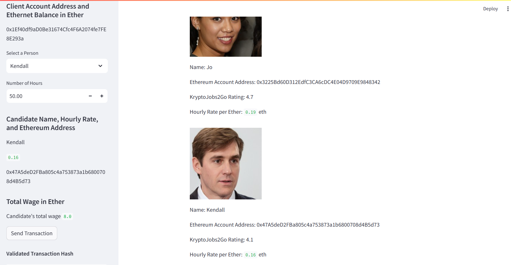
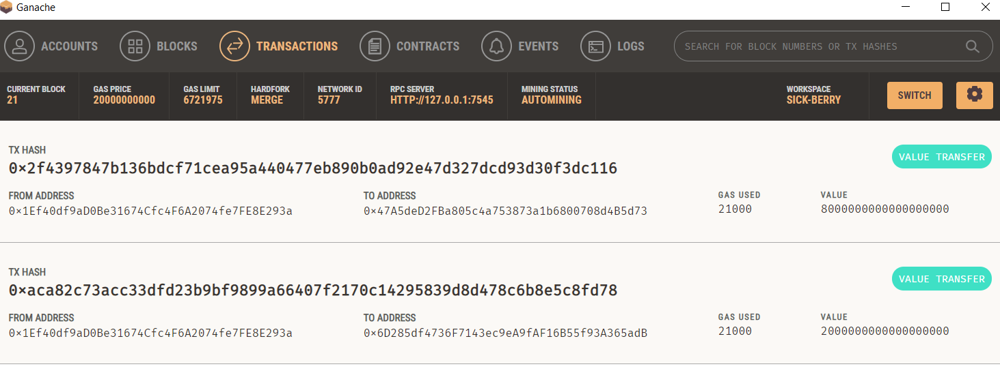
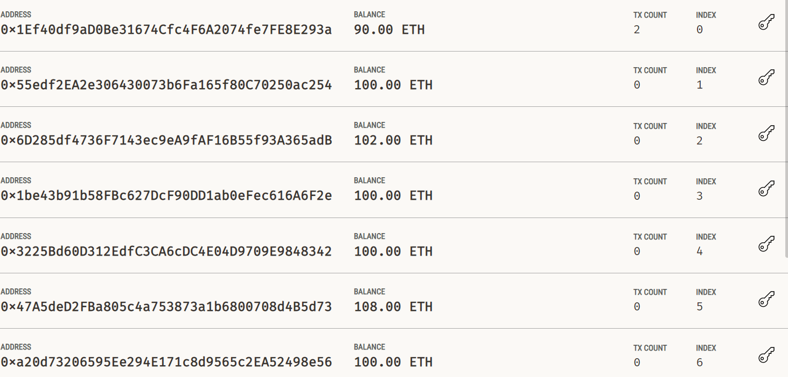

# Cryptocurrency Wallet

### Background

You work at a startup that is building a new and disruptive platform called KryptoJobs2Go. KryptoJobs2Go is an application that its customers can use to find fintech professionals from among a list of candidates, hire them, and pay them. As KryptoJobs2Go’s lead developer, you have been tasked with integrating the Ethereum blockchain network into the application in order to enable your customers to instantly pay the fintech professionals whom they hire with cryptocurrency.

In this Git rep, a code is implememted that enables the customers to send cryptocurrency payments to fintech professionals. To develop the code and test it out, it is assumed that the perspective of a KryptoJobs2Go customer who is using the application to find a fintech professional and pay them for their work.

### What You're Creating

To complete this Challenge,two Python files are used, both of which are contained in the starter folder.

The first file that is used is  `krypto_jobs.py`. It contains the code associated with the web interface of your application. The code included in this file is compatible with the Streamlit library.

The second file  is  `crypto_wallet.py`. This file contains the Ethereum transaction functions. By using import statements,  `crypto_wallet.py` Python script is integrated into the KryptoJobs2Go interface program.

Integrating these two files allowed to automate the tasks associated with generating a digital wallet, accessing Ethereum account balances, and signing and sending transactions via a personal Ethereum blockchain called Ganache.

### Instructions

The steps for this challenge are broken out into the following sections:

* Import Ethereum Transaction Functions into the KryptoJobs2Go Application
* Sign and Execute a Payment Transaction
* Inspect the Transaction on Ganache

#### Streamlit Web Interface:

| 

#### Ganache Validation

|                                        |    